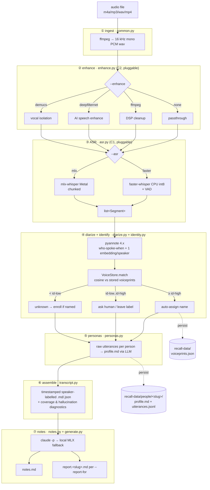

# Recall — Architecture & Developer/Agent Guide

> Canonical reference for **using**, **operating**, and **extending** Recall (the
> `recall` package).
> If you are an agent picking this repo up cold: read [`AGENTS.md`](../AGENTS.md)
> first (the short working brief), then this file for depth. The design rationale
> lives in §9 below. The README is the short user-facing version; this is the deep
> one.

---

## 1. What it is

A **command-line tool** that turns a recorded meeting (Hinglish — mixed Hindi +
English) into:

1. a timestamped, **speaker-labelled transcript** (`.md` + `.json`),
2. **English meeting notes** (summary / decisions / action items),
3. **persistent speaker identities** — name a voice once, auto-recognize it in
   later meetings (no clean voice samples needed), and
4. **per-person collaboration profiles** + optional **reports tailored** to how a
   person likes to receive information.

Everything runs **locally on-device** except the final text generation (notes /
personas / reports), which uses your Claude subscription via `claude -p` with a
**fully-local MLX fallback**. The paid API is never required (guardrail **L2**).

---

## 2. Pipeline architecture

Seven sequential stages. Sequential on purpose: the 18 GB unified-memory budget
can't hold Whisper, pyannote, and a local LLM at once (guardrail **L4**).



**The one data type that flows through everything:** `Segment(start, end, text,
speaker?, avg_logprob?)` (defined in `common.py`). ASR produces `list[Segment]`;
every downstream stage reads/annotates that list. This is why the ASR backend, the
enhancer, and the language are **configuration, not forks** (guardrail **L5**) —
swap any of them and the rest of the pipeline is untouched.

---

## 3. Machine-learning models (what + why)

| Stage | Model | Backend | Purpose | Notes |
|---|---|---|---|---|
| ASR | `large-v3-turbo` | **faster-whisper** (CPU int8, CTranslate2) | Speech→text; the **proven** path, runs everywhere, has built-in VAD + hallucination controls | default `--model large-v3-turbo`; `--asr faster` |
| ASR | `mlx-community/whisper-large-v3-turbo` | **mlx-whisper** (Apple Metal/GPU) | Same job, native on Apple Silicon, faster on M-series | `--asr mlx`; **weaker on `--language hi`** — can loop-hallucinate (use `--language en`) |
| Diarization | `pyannote/speaker-diarization-3.1` | pyannote.audio 4.x (Torch/MPS) | "Who spoke when" + one speaker embedding per speaker | pulls `segmentation-3.0` **and** `speaker-diarization-community-1` (embedding model) — all 3 gated, need one-time HF accept |
| Speaker embedding | `speaker-diarization-community-1` | (inside pyannote 4.x) | The ~256-d voiceprint vector that feeds the identity layer | bridge into `identity.py` |
| Notes / personas / reports | Claude (via `claude -p`) | Claude Code headless | Translate Hinglish + write notes/personas/reports in one shot; repairs ASR garbles | **primary**, uses Max subscription, no API billing |
| Notes / personas / reports (offline) | `mlx-community/Qwen2.5-7B-Instruct-4bit` | mlx-lm (Metal) | Local fallback when Claude absent → fully offline | `--notes-engine local`; ~4.5 GB, ~250 s for notes |
| Enhance (optional) | DeepFilterNet | `deepFilter` CLI | AI speech denoise/enhance | `--enhance deepfilternet`; can hurt some files — A/B it |
| Enhance (optional) | Demucs | `demucs` CLI | Vocal isolation from noisy background | `--enhance demucs` |

**Why no local Hindi→English translation step (D1):** a small local translator
injects errors Claude can't undo. The local pipeline produces only a faithful raw
transcript; Claude (or Qwen) does translation *and* notes in one pass.

---

## 4. Install (Apple Silicon Mac)

### Hardware / OS requirements
- **Apple Silicon** (M1/M2/M3…). M3 Pro / 18 GB unified memory is the reference
  machine. 16 GB works (stages are sequential); 8 GB is tight.
- ~10–15 GB free disk for model weights (Whisper + pyannote + optional Qwen).
- macOS with Metal. `faster-whisper` (CPU) also runs on Intel/Linux, but `mlx`,
  Metal metrics, and MPS diarization are Apple-Silicon-only.

### One-time setup
```bash
# system tools
brew install ffmpeg
npm install -g @anthropic-ai/claude-code   # then run `claude` once to log in

# python env + editable install of the package with the extras you want
#   (this repo conventionally uses a uv-managed venv at .venv-transcribe/)
uv venv .venv-transcribe
VIRTUAL_ENV=.venv-transcribe uv pip install -e '.[all]'
#   ^ installs recall + ASR backend(s), pyannote, tqdm/psutil, mlx-lm.
#   extras are declared in pyproject.toml: mlx | faster | diarize | enhance |
#   romanize | all. Plain pip works too: pip install -e '.[all]'.

# diarization access (one-time; then local forever).
#   1. free huggingface.co account
#   2. accept conditions on ALL THREE gated models:
#        https://huggingface.co/pyannote/segmentation-3.0
#        https://huggingface.co/pyannote/speaker-diarization-3.1
#        https://huggingface.co/pyannote/speaker-diarization-community-1
#   3. create a token at https://huggingface.co/settings/tokens
export HF_TOKEN=hf_xxx          # put in ~/.zshrc to persist
```

> Note: a `uv`-managed venv has no `pip` module — install with
> `VIRTUAL_ENV=.venv-transcribe uv pip install ...`. A plain `python3 -m venv`
> venv has `pip` and works with `pip install -e '.[all]'` directly.

First run downloads model weights into the HF cache; subsequent runs are offline.

---

## 5. Usage

```bash
# typical: speaker labels on, Claude notes with local fallback
python -m recall ~/VoiceMemos/standup.m4a

# proven config on real Hinglish meeting audio (recommended defaults today)
python -m recall meeting.m4a --asr faster --language en

# later runs auto-recognize people; tailor reports to two of them
python -m recall team-sync.m4a --report-for "Priya" --report-for "Rahul"

# fully offline (no Claude): local MLX notes
python -m recall call.m4a --notes-engine local

# transcript only / no speaker labels
python -m recall call.m4a --notes-engine none
python -m recall call.m4a --no-diarize

python -m recall --help        # every flag
```

**Outputs** land in `--output-dir` (default `~/.recall`), named
`<DD-MM-YYYY>_<title>_<file>` (title = `--title` or filename slug):
`<stem>.transcript.md`, `<stem>.transcript.json`, `<stem>.notes.md`, and
`<stem>.report.<slug>.md` per `--report-for`.

**Dedup.** Each run is keyed by the audio's sha256 in a SQLite index
(`store.py`, db at `<data-dir>/../recall.db` → `~/.recall/recall.db` by default).
A repeat run on the same content short-circuits before ASR and prints the existing
transcript/notes paths; `--force` regenerates and overwrites the row.

**Operating long jobs** (a 50-min recording is ~10–20 min on CPU ASR): run in the
background and tail the log, e.g.
`nohup python -m recall big.m4a ... > logs/run.log 2>&1 &`. Do not run two heavy
ASR jobs concurrently — they thrash CPU and risk the memory budget.

---

## 6. CLI reference — every argument and its purpose

| Flag | Default | Purpose |
|---|---|---|
| `AUDIO` | — | input audio/video file (m4a/mp3/wav/mp4…) |
| `-o, --output-dir` | `~/.recall` | where transcript/notes/reports are written |
| `--title` | — | meeting title used in the dated output filename and the store |
| `--force` | off | regenerate even if this audio is already in the store |
| **ASR (C1)** | | |
| `--asr {auto,mlx,faster}` | `auto` | backend. `auto` = try mlx then faster. `faster` is the proven path; `mlx` is fastest on Apple Silicon but weaker on `hi` |
| `--model` | backend turbo | ASR model id (`large-v3` for max accuracy/slower) |
| `--language` | `en` | language hint. `en` = Roman/English output (default, best for Hinglish notes), `hi` = native Devanagari, `auto` = detect |
| `--chunk-seconds` | `240` | ASR chunk size for the progress bar; `0` = single max-accuracy pass (mlx only; faster streams) |
| **Enhance (C2)** | | |
| `--enhance {none,ffmpeg,deepfilternet,demucs}` | `none` | audio cleanup. File-dependent — A/B per recording |
| `--denoise` | — | deprecated alias for `--enhance demucs` |
| `--deepfilter-command` | `deepFilter` | DeepFilterNet CLI name |
| **Diarization** | | |
| `--diarize` / `--no-diarize` | on | speaker labels via pyannote |
| `--hf-token` | env `HF_TOKEN` | pyannote auth (gated models) |
| **Identity & personas** | | |
| `--data-dir` | `~/.recall/data` | persistent voiceprint + persona store |
| `--no-enroll` | off | unattended: auto-assign confident matches only, never prompt for names |
| `--id-high` | `0.70` | cosine ≥ this → auto-assign a known speaker |
| `--id-low` | `0.45` | cosine in `[id-low, id-high)` → ambiguous, ask the human |
| `--no-personas` | personas on | skip building/updating per-person profiles |
| `--persona-prompt` | `prompts/persona.md` | persona-update instruction file |
| `--report-for NAME` | — | also write a report tailored to NAME's profile (repeatable) |
| `--report-prompt` | `prompts/report.md` | tailored-report instruction file |
| **Notes / output** | | |
| `--notes-engine {auto,claude,local,none}` | `auto` | `auto` = Claude then local; `none` = transcript only |
| `--local-model` | `Qwen2.5-7B-Instruct-4bit` | offline notes model (mlx-lm) |
| `--notes-prompt` | `prompts/notes.md` | notes instruction file |
| `--romanize` | off | transliterate Devanagari → Roman (ITRANS) |
| `--no-progress` | off | disable progress bars / live resource readout (scripts/cron) |

---

## 7. Programmatic / internal API surface

recall is a CLI, not a network service — **it exposes no HTTP/socket API and binds
no port**. Its "API" is the Python package. Stable entry points:

| Symbol | Signature (abbrev.) | Role |
|---|---|---|
| `recall.cli.main(argv=None)` | → None | parse args + run; `python -m recall` calls this |
| `recall.pipeline.run(cfg)` | `cfg: argparse.Namespace` → None | the whole orchestration; pass a config object with the CLI attributes |
| `recall.asr.transcribe(backend, wav, language, chunk_s, model, metrics, progress, work)` | → `list[Segment]` | **C1 dispatch**; add a backend in `_REGISTRY` |
| `recall.enhance.enhance(name, wav, work, metrics, progress, df_cmd)` | → `Path` | **C2 dispatch**; add an enhancer in `_REGISTRY` |
| `recall.diarize.diarize(wav, hf_token, metrics, progress)` | → `(turns, emb_map)` | who-spoke-when + voiceprints |
| `recall.diarize.assign_speakers(segs, turns)` | mutates segs | overlap-based label stamping |
| `recall.identity.VoiceStore` | `match()/enroll()/save()/names()` | persistent voiceprints, cosine match |
| `recall.identity.resolve_identities(segs, emb_map, vstore, id_high, id_low, enroll)` | → `{label: name}` | label → real name |
| `recall.personas.PersonaStore` | `add_utterances/read_profile/update_profile…` | living profiles |
| `recall.generate.make_generator(engine, local_model, metrics, progress)` | → `generate(instructions, content, label)` | shared Claude→local text engine (used by notes/personas/reports) |
| `recall.transcript.coverage(segs, duration, …)` | → dict | coverage + hallucination diagnostics (**L6**) |
| `recall.store.lookup(db, sha)` / `record(db, **row)` / `dated_stem(...)` | dedup index | SQLite by audio sha256; skip regen on repeat runs |
| `recall.common.audio_sha256(path)` | → str | content hash (dedup key) |
| `recall.transcript.build_transcript(segs, title, cov)` | → `(md, json)` | assemble outputs |
| `recall.common.Segment` | dataclass | the unit every stage consumes |

**On-disk data contract** (`--data-dir`, biometric — keep local):
```
recall-data/
├── voiceprints.json          {version, people:{<name>:{centroid[256], n_samples, dim, updated}}}
└── people/<slug>/
    ├── profile.md            living collaboration profile (LLM-maintained, hand-editable)
    └── utterances.jsonl      {date,start,end,text} append-only, raw (pre-romanization)
```

**Prompts** are plain Markdown in `src/recall/prompts/{notes,persona,report}.md` —
editable without touching code; override per-run with `--*-prompt`.

---

## 8. Agent / developer guide

### 8.1 Code map — where to look first
- **Understand control flow:** `pipeline.py:run()` — the 7 stages in order, top to
  bottom. Every other module is called from here.
- **Per-capability logic:** one module per slice (see `__init__.py` docstring).
  Each module's top docstring states its contract.
- **The data unit:** `common.py:Segment`. Trace it from `asr.py` outward.
- **Config/arg surface:** `cli.py:build_parser()` — every flag, default, help text.
- **Tests:** `tests/test_identity.py` (pure identity logic) and
  `tests/test_pipeline.py` (coverage diagnostics + a fully-mocked end-to-end run).

### 8.2 How to add a feature
The package is built around two pluggable registries — adding to them is the
designed extension path (guardrail **L5**):

- **New ASR backend:** write `_yourbackend(wav, language, chunk_s, model, metrics,
  progress, work) -> list[Segment]` in `asr.py`, add it to `_REGISTRY` and
  `DEFAULT_MODEL`, add a `--asr` choice in `cli.py`. Nothing downstream changes.
- **New enhancer:** write `_yours(wav, work, metrics, progress, df_cmd) -> Path` in
  `enhance.py`, register in `_REGISTRY`, add a `--enhance` choice. Must return a
  16 kHz mono wav and **fall back to the input on failure** (never crash the run).
- **New text-generation engine:** extend `generate.py:make_generator` — keep the
  Claude-primary / local-fallback contract (**L2**: never *require* the paid API).
- **New output:** add a writer in `notes.py` or a new module, call it from
  `pipeline.py` after assemble.

Conventions: **degrade gracefully** — a missing optional dep logs and no-ops, it
never raises (see every `try/except ImportError` and the enhancer fallbacks). Keep
stages **sequential** (**L4**). Name things for their domain purpose. Keep diffs
minimal; don't reformat unrelated code.

### 8.3 How to fix a bug / debug
- Reproduce with `--no-progress` first (removes the live readout from the picture).
- Logs go to **stderr** (`common.log`); stdout stays clean for piping. Real
  failures are logged as `[recall] ... ` lines; ASR/enhancer/diarize failures fall
  back rather than crash, so **read the warnings**, not just the exit code.
- Library API drift is the most common breakage (this stack moves fast). Three real
  examples already fixed, all one-liners (see `git log`): psutil on macOS, pyannote
  `use_auth_token`→`token`, pyannote 4.x `DiarizeOutput`. When a backend "fails",
  suspect a renamed kwarg or changed return shape first.
- The coverage diagnostic is a **correctness signal**: low coverage ⇒ audio
  dropped; high `repetition` / very low `mean_logprob` ⇒ ASR hallucination loop.
  Trust it when a transcript looks wrong.

### 8.6 Security & privacy notes
- **Untrusted input → LLM.** The transcript (derived from arbitrary audio) is piped
  verbatim into `claude -p` / the local model as prompt input. Treat generated
  notes/personas/reports as influenced by the recording's content (prompt-injection
  surface); don't auto-execute anything from them.
- **No secrets in code.** The only credential is `HF_TOKEN`, read from the
  environment or `--hf-token` — never hard-code it.
- **Biometric data stays local.** `recall-data/` (voiceprints + personas) and all
  audio/transcripts/notes are git-ignored by default; keep them that way. Don't
  commit real names, recordings, or meeting content to a shared repo.

### 8.4 Tests
```bash
python tests/run.py        # no pytest needed — 13 tests; or: pytest tests/
```
Add a test alongside any behavior change. The end-to-end test mocks ASR +
diarization so it runs anywhere (only ffmpeg required).

### 8.5 Guardrails — do not regress these
- **L2** never require the paid API (Claude-primary / local-fallback).
- **L3** personas = evidence + hedged read, never fixed trait scores; all
  speaker/persona data stays **local** (biometric; BIPA/GDPR-sensitive).
- **L4** stages sequential — never hold Whisper + local LLM resident at once.
- **L5** ASR backend, enhancer, and language are **config behind interfaces**, not
  forks.
- **L6** every run reports coverage + hallucination diagnostics.

---

## 9. Design decisions (the contract)

Recall is the merge of two earlier designs — a proven single-script pipeline
(faster-whisper, `en`, ffmpeg/DeepFilterNet) and a richer unrun spec (mlx-whisper,
diarization, identity, personas). These are the **locked** decisions (L) and the
three genuinely **contested** axes (C) that were therefore made configurable. Don't
silently overturn an L; the C axes are settled by evidence, not argument.

**Locked (L):**
- **L1** — adopt the full superstructure: diarization, voiceprint identity,
  personas, tailored reports, the Claude→local notes engine, the persistent store.
- **L2** — notes/personas/reports are Claude-primary with an automatic local-MLX
  fallback; the **paid API is never required**.
- **L3** — personas are evidence-backed observations + a hedged tone read, never
  fixed trait scores; all speaker/persona data stays **local** (biometric;
  BIPA/GDPR-sensitive).
- **L4** — stages run **sequentially**; never hold Whisper and the local LLM
  resident at once (18 GB unified-memory budget).
- **L5** — the ASR backend, the enhancer, and the language are **configuration
  behind clean interfaces** (`--asr` / `--enhance` / `--language`), not forks. This
  is what lets the contested axes below be flags instead of rewrites.
- **L6** — every run reports coverage **and** hallucination diagnostics
  (repetition ratio + mean logprob), so a clean-looking transcript that silently
  dropped or looped is caught.

**Contested → made configurable (C):** decided per recording by **Claude-judged
notes quality**, tie-broken by coverage then speed (run `scripts/ab_test.py`).
- **C1** ASR backend — `faster` (proven, portable, VAD) vs `mlx` (Metal-fast, but
  weaker on `hi`). Default `auto` (mlx then faster).
- **C2** enhancer — `none` / `ffmpeg` / `deepfilternet` / `demucs`. **File-dependent**
  (DeepFilterNet helped some files, looped on others), so it stays a flag.
- **C3** language — `en` (Roman, easiest to summarize) vs `hi` (native Devanagari,
  Claude translates once at the end). **Default `en`** — the proven config; `hi`
  available for native-script transcripts.

> Whisper settings baked into the `faster` backend (from the proven pipeline):
> `beam_size=5`, `condition_on_previous_text=False` (curbs loops), `vad_filter=True`
> with a low `0.2` threshold (keeps soft speech), `hallucination_silence_threshold=2`.

---

## 10. Known limitations / roadmap
- mlx + `--language hi` can produce runaway hallucination loops on some files; the
  proven config is `--asr faster --language en`. The repetition/logprob warnings
  (L6) now flag this automatically.
- Identity thresholds (`--id-high/--id-low`) are calibrated for a handful of
  speakers; revisit once the store has many people.
- Interactive enrollment requires a TTY; for unattended runs use `--no-enroll` or
  pre-seed with `scripts/seed_voiceprints.py`.
- Not yet built (roadmap): `recall people` management command, `setup.sh`,
  `--batch` folder mode, threshold auto-calibration, non-destructive VAD,
  cross-meeting rollups.
